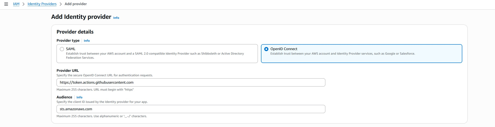

## Configure OIDC for GitHub Actions

Configure in the AWS console as per following



**Create an OIDC Trust Policy**

```bash
{
  "Version": "2012-10-17",
  "Statement": [
    {
      "Effect": "Allow",
      "Principal": {
        "Federated": "arn:aws:iam::381491977476:oidc-provider/token.actions.githubusercontent.com"
      },
      "Action": "sts:AssumeRoleWithWebIdentity",
      "Condition": {
        "StringLike": {
          "token.actions.githubusercontent.com:sub": "repo:amirul1994/eks_rds:*"
        }
      }
    }
  ]
}
```

**Create Role Using the trust policy**

```bash
aws iam create-role \
  --role-name github-actions-ecr-role \
  --assume-role-policy-document file://oidc_trust_policy.json
```

**Attach policy to Push to ECR**

```bash
aws iam attach-role-policy \
  --role-name github-actions-ecr-role \
  --policy-arn arn:aws:iam::aws:policy/AmazonEC2ContainerRegistryFullAccess
```