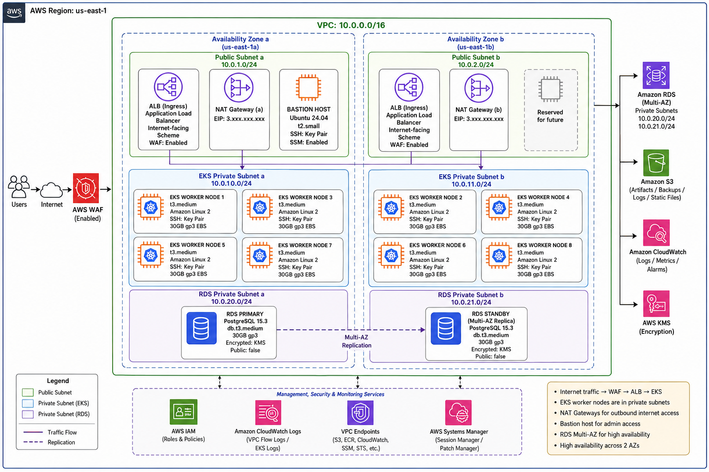
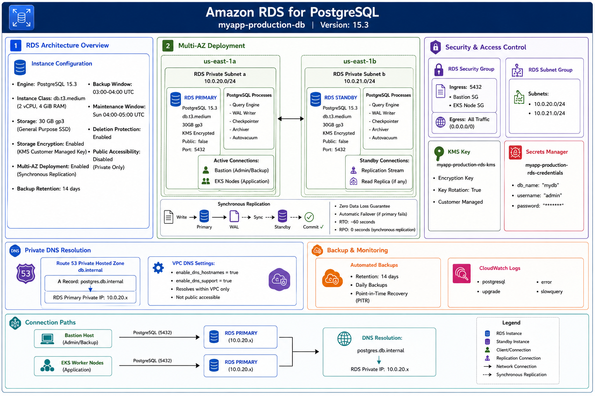
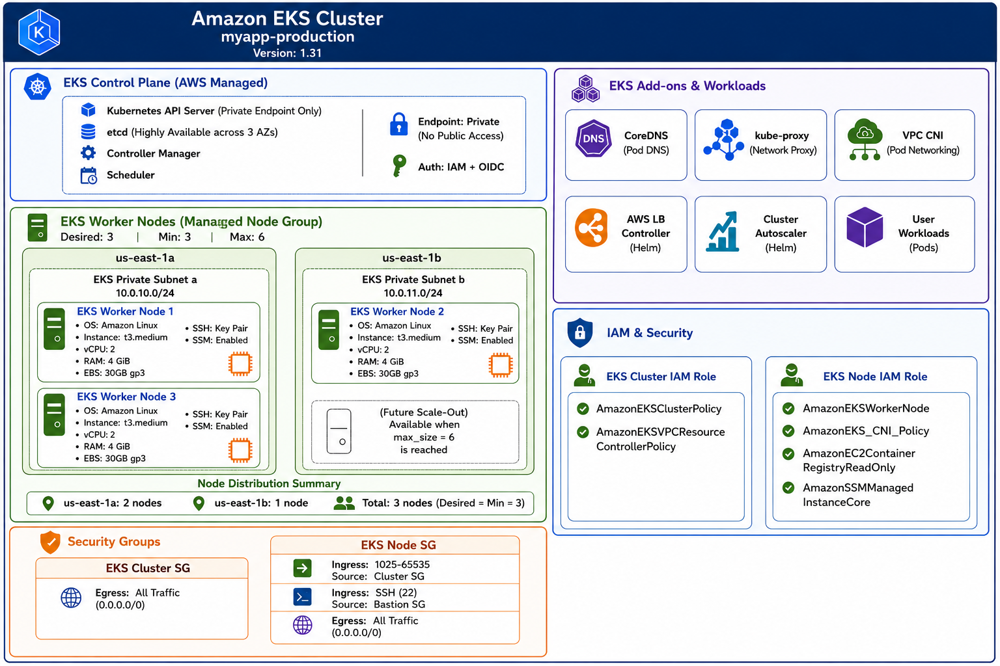

## Complete Diagram



## RDS



EKS and RDS are both placed in the same vpc. EKS worker nodes are deployed in private subnets 10.0.10.0/24, 10.0.11.0/24. RDS instance is deployed in separate priavte subnets 10.0.20.0/24 and 10.0.21.0/24. 

A VPC endpoint allows private connectivity to the aws services (e.g s3, dynamodb) without traversing to the internet. Aws rds doesn't support vpc endpoints (aws privatelink) for database conections. In this architecture, rds is deployed directly inside private subnets. RDS has no public ip assigned, nat gateways are configured for outbound internet access from private subnets.

A route 53 private hosted zone is created and associated with the vpc. It provides the internal dns resolution for the rds database. EKS pods and bastion need a consistent way to locate the rds endpoint. The dns name works with the underlying rds instance, so the ip of the rds instance can be updated without changing the application code. As it is a private hosted zone, the dns name resolves only within the vpc.

The security groups provide the necessary isolation for inbound and outbound traffic. The rds security group allows incoming traffic only from bastion security group and eks node security group on port 5432. All outbound traffic are allowed.

The backend can access to the databse through a combination of network isolation, security group rules, private dns and credential management.

The primary mechanism is the rds security group, there are two inbound rules
a) Inbound rule 1 - allows traffic on port 5432 only from eks node security group
b) Inbound rule 2 - allows traffic on port 5432 only from the bastion security group

So only resources that are in the eks cluster node sg and bastion sg can connect to the database.  

RDS resolves to a private dns name only within the vpc. The route 53 hosted zone is associated only with this vpc. The database username and password are stored in the aws secret manager. The backend retrieve these credentials at runtime via IAM roles and the secret manager api. EKS pods use iam roles for service accounts (irsa) to authenticate to aws service. Only the backend service account has permission to read secret from secrets manager. In the code, it is needed to add aws sdk, and in the backend service account add the following annotations.

```bash
annotations:
    eks.amazonaws.com/role-arn: arn:aws:iam::<ACCOUNT-ID>:role/myapp-production-backend-sa-irsa
```

The database credential are stored in aws secret manager. The secrets are stored in json format.

```bash
aws secretsmanager create-secret \
 --name "myapp-production-rds-credentials" \
 --secret-string '{"db_name":"mydb","username":"admin","password":"passwordwithuppercaselowercasenumberspecialcharacter"}' \
 --region us-east-1
```
The secret is encrypted when it is stored via aws kms. The terraform execution role has permission to read the secret during 'terraform apply'. The backend pods are given irsa that grants read-only permission to secrets manager for the rds credentials. The eks backend doesn't store the credentials on persistent volume, environment variables or in kubenetes secrets. The app retrieves the secret at startup using aws sdk and irsa. The secret value held in the applications memory for the lifetime of the pod.


## EKS



For eks deployment, I have created modules. The terraform directory structure for is as follows -
```text
terraform/
├── backend.tf
├── provider.tf
├── variables.tf
├── outputs.tf
├── main.tf
├── terraform.tfvars
├── .gitignore
└── modules/
    ├── vpc/
    │   ├── main.tf
    │   ├── variables.tf
    │   └── outputs.tf
    ├── eks/
    │   ├── main.tf
    │   ├── variables.tf
    │   └── outputs.tf
    ├── rds/
    │   ├── main.tf
    │   ├── variables.tf
    │   └── outputs.tf
    ├── bastion/
    │   ├── main.tf
    │   ├── variables.tf
    │   └── outputs.tf
    ├── waf/
    │   ├── main.tf
    │   ├── variables.tf
    │   └── outputs.tf
    └── iam/
        ├── main.tf
        ├── variables.tf
        └── outputs.tf
```


**Architecture**

- **VPC**
  - The vpc provides an isolated virtual network of all necessary aws resources for eks. 
  - It spans two azs with public and private subnets.
  - The vpc configured with cidr block 10.0.0.0/16

- **Network & Subnet Design**
  - The network consists of 6 subnets across two azs. 
  - 2 public subnets for bastion and ALB, 2 rds private subnets for db isolation.
  - Public subnets have direct internet acces via Internet gateway, private subnets route through NAT gateways for outbound internet access only.

- **EKS**
  - AWS eks is used as the managed kuberntes service control plane, version 1.31 with priavet endpoint access only.
  - The control plane is automatically distributed across multiple azs, all cluster authentication is handled through iam and oidc.
  - The cluster uses IRSA (IAM roles for Service accounts) with seperate roles for ALB controller and backend app.

- **Node pool or node group**
  - EKS managed node groups with ec2 launch type providing full control over worker nodes (e.g. patching, provisioning)
  - The node group uses EKS-optimized Amazon Linux 2 with t3 medium instances (2 vcpu, 4 gb ram) and 30 gb gp3 ebs volume.
  - The desired and minimum number of nodes is 3 and the nax is 6

- **ECR**
  - Two seperate repositories are created: backend and frontend, with image scanning enabled.
  - ECR integrates seamlessly with EKS, the worker nodes IAM role includes AmazonEC2ContainerRegistryReadOnly policy to pull images.

- **Monitoring: Cloudwatch**
  - Control plane logging is enabled via Terraform for all log types (api, audit, authenticator, controllerManager, scheduler) with 30‑day retention, sending logs to CloudWatch Logs for security auditing and troubleshooting. Cloudwatch automatically provides monitoring for control plane without any cost.
  - Data plane monitoring (CPU, memory, network, disk) and logging are provided by CloudWatch Container Insights, which is installed as a post‑creation add‑on and ships metrics and container logs to CloudWatch.

- **Private database connectivity**
  - The rds database is deployed in private subnets with no public ip, accessible only from the bastion host and eks worker nodes through security group rules on port 5432.
  -  A Route 53 Private Hosted Zone (db.internal) with an A record (postgres.db.internal) provides private DNS resolution within the VPC, eliminating the need to hardcode IP addresses.
  - Database credentials are retrieved at runtime via AWS Secrets Manager and IRSA, never stored in application code, environment variables, or Kubernetes secrets.

- **Remote backend and state locking**
  - A S3 bucket is used as remote backend. The remote backend ensures a consistent state file, it eases the team collaboration and prevents state file corruption. 
  - Previously, a dynamodb table was used for state locking. State locking prevents two persons to write the state file at the same time. From terraform 1.10, hashicorp has introduced s3 state lock. In s3 state lock, terraform creates a temporary .tflock file while running the state file modification command, this file prevents simultaneous modification of the state file.

- **Variables for environment, region, cluster name, node size, node count, and Kubernetes version**
  - All configuration parameters are defined as variables in the root variables.tf file with production-ready defaults, eliminating the need for .tfvars files. 
  - Variables include: environment (production), aws_region (us-east-1), project_name (myapp), eks_cluster_version (1.31), eks_node_instance_type (t3.medium), and eks_node_desired_size (3), eks_node_min_size (3), eks_node_max_size (6). 
  - Sensitive variables like rds_password are retrieved from AWS Secrets Manager, while non-sensitive values can be overridden via environment variables (TF_VAR_*) if needed. This design ensures flexibility, reusability, and clear separation of configuration from code.

- **Outputs for cluster name, endpoint, registry name, and network ID**
  - Required outputs are exposed in outputs.tf for easy integration with CI/CD pipelines and operational scripts. Outputs include: eks_cluster_name (cluster name), eks_cluster_endpoint (API server endpoint), backend_repository_name and frontend_repository_name (registry names), and network_id (VPC ID). 
  - Additional outputs are provided for EC2 instances, RDS endpoints, ECR repository URLs, WAF ARNs, and IRSA role ARNs for comprehensive infrastructure visibility. All outputs are properly tagged with descriptions and sensitive values are marked accordingly.

The following steps need to be done before provisioning eks cluster.

**Step 1**

A ssh keypair is generated to ssh to the bastion and eks worker nodes.

```bash
ssh-keygen -t rsa -b 4096 -f ~/.ssh/myapp-key -C "myapp-production"
```

Import the key pair

```bash
aws ec2 import-key-pair \
  --key-name "myapp-production-key" \
  --public-key-material fileb://~/.ssh/myapp-key.pub \
  --region us-east-1
```

**Step 2 S3 bucket Creation**

```bash
aws s3api create-bucket --bucket amirul-logic-matrix --region us-east-1
```

```bash
aws s3api put-bucket-versioning --bucket amirul-logic-matrix --versioning-configuration Status=Enabled
```

```bash
aws s3api put-bucket-encryption \
  --bucket amirul-logic-matrix \
  --server-side-encryption-configuration '{"Rules":[{"ApplyServerSideEncryptionByDefault":{"SSEAlgorithm":"AES256"}}]}'
```

```bash
aws s3api put-public-access-block \
  --bucket amirul-logic-matrix \
  --public-access-block-configuration "BlockPublicAcls=true,IgnorePublicAcls=true,BlockPublicPolicy=true,RestrictPublicBuckets=true"
```

**Step 3 Storing DB Secrets in AWS Secrets Manager**

I have stored rds credentials in the aws secret manager.

```bash
aws secretsmanager create-secret \
 --name "myapp-production-rds-credentials" \
 --secret-string '{"db_name":"mydb","username":"dbadmin","password":"passwordwithuppercaselowercasenumberspecialcharacter"}' \
 --region us-east-1
```

**Step 4 AWS Load Balancer Controller Policy**

```bash
curl -o alb-controller-policy.json https://raw.githubusercontent.com/kubernetes-sigs/aws-load-balancer-controller/main/docs/install/iam_policy.json
```

```bash
aws iam create-policy \
  --policy-name AWSLoadBalancerControllerPolicy \
  --policy-document file://alb-controller-policy.json
```


**Step 5 Initialize Terraform with Remote Backend**

```bash
cd terraform/
terraform init \
  -backend-config="bucket=amirul-logic-matrix" \
  -backend-config="key=terraform/state.tfstate" \
  -backend-config="region=us-east-1" \
  -backend-config="use_lockfile=true
```

**Step 5 Terraform Plan**

```bash
terraform plan
```

<details>
<summary>Terraform Plan Output</summary>

## Terraform Plan

```text
 terraform plan
module.rds.data.aws_secretsmanager_secret.rds_credentials: Reading...
module.rds.data.aws_secretsmanager_secret.rds_credentials: Read complete after 1s [id=arn:aws:secretsmanager:us-east-1:801128757205:secret:myapp-production-rds-credentials-Z8JKFM]
module.rds.data.aws_secretsmanager_secret_version.rds_credentials: Reading...
module.rds.data.aws_secretsmanager_secret_version.rds_credentials: Read complete after 1s [id=arn:aws:secretsmanager:us-east-1:801128757205:secret:myapp-production-rds-credentials-Z8JKFM|AWSCURRENT]

Terraform used the selected providers to generate the following execution plan. Resource actions are
indicated with the following symbols:
  + create
 <= read (data resources)

Terraform will perform the following actions:

  # aws_ecr_repository.backend will be created
  + resource "aws_ecr_repository" "backend" {
      + arn                  = (known after apply)
      + id                   = (known after apply)
      + image_tag_mutability = "MUTABLE"
      + name                 = "myapp-production-backend"
      + registry_id          = (known after apply)
      + repository_url       = (known after apply)
      + tags                 = {
          + "Component" = "backend"
          + "Name"      = "myapp-production-backend"
        }
      + tags_all             = {
          + "Component"   = "backend"
          + "Environment" = "production"
          + "ManagedBy"   = "Terraform"
          + "Name"        = "myapp-production-backend"
          + "Project"     = "myapp"
        }

      + image_scanning_configuration {
          + scan_on_push = true
        }
    }

  # aws_ecr_repository.frontend will be created
  + resource "aws_ecr_repository" "frontend" {
      + arn                  = (known after apply)
      + id                   = (known after apply)
      + image_tag_mutability = "MUTABLE"
      + name                 = "myapp-production-frontend"
      + registry_id          = (known after apply)
      + repository_url       = (known after apply)
      + tags                 = {
          + "Component" = "frontend"
          + "Name"      = "myapp-production-frontend"
        }
      + tags_all             = {
          + "Component"   = "frontend"
          + "Environment" = "production"
          + "ManagedBy"   = "Terraform"
          + "Name"        = "myapp-production-frontend"
          + "Project"     = "myapp"
        }

      + image_scanning_configuration {
          + scan_on_push = true
        }
    }

  # module.backend_irsa.data.aws_iam_policy_document.assume_role will be read during apply
  # (config refers to values not yet known)
 <= data "aws_iam_policy_document" "assume_role" {
      + id   = (known after apply)
      + json = (known after apply)

      + statement {
          + actions = [
              + "sts:AssumeRoleWithWebIdentity",
            ]
          + effect  = "Allow"

          + condition {
              + test     = "StringEquals"
              + values   = [
                  + "system:serviceaccount:default:backend-sa",
                ]
              + variable = (known after apply)
            }

          + principals {
              + identifiers = [
                  + (known after apply),
                ]
              + type        = "Federated"
            }
        }
    }

  # module.backend_irsa.aws_iam_role.this will be created
  + resource "aws_iam_role" "this" {
      + arn                   = (known after apply)
      + assume_role_policy    = (known after apply)
      + create_date           = (known after apply)
      + force_detach_policies = false
      + id                    = (known after apply)
      + managed_policy_arns   = (known after apply)
      + max_session_duration  = 3600
      + name                  = "myapp-production-backend-sa-irsa"
      + name_prefix           = (known after apply)
      + path                  = "/"
      + role_last_used        = (known after apply)
      + tags                  = {
          + "Name" = "myapp-production-backend-sa-irsa"
        }
      + tags_all              = {
          + "Environment" = "production"
          + "ManagedBy"   = "Terraform"
          + "Name"        = "myapp-production-backend-sa-irsa"
          + "Project"     = "myapp"
        }
      + unique_id             = (known after apply)

      + inline_policy (known after apply)
    }

  # module.backend_irsa.aws_iam_role_policy_attachment.secrets_manager[0] will be created
  + resource "aws_iam_role_policy_attachment" "secrets_manager" {
      + id         = (known after apply)
      + policy_arn = "arn:aws:iam::aws:policy/SecretsManagerReadWrite"
      + role       = "myapp-production-backend-sa-irsa"
    }

  # module.bastion.aws_iam_instance_profile.bastion will be created
  + resource "aws_iam_instance_profile" "bastion" {
      + arn         = (known after apply)
      + create_date = (known after apply)
      + id          = (known after apply)
      + name        = "myapp-production-bastion-profile"
      + name_prefix = (known after apply)
      + path        = "/"
      + role        = "myapp-production-bastion-role"
      + tags_all    = {
          + "Environment" = "production"
          + "ManagedBy"   = "Terraform"
          + "Project"     = "myapp"
        }
      + unique_id   = (known after apply)
    }

  # module.bastion.aws_iam_role.bastion will be created
  + resource "aws_iam_role" "bastion" {
      + arn                   = (known after apply)
      + assume_role_policy    = jsonencode(
            {
              + Statement = [
                  + {
                      + Action    = "sts:AssumeRole"
                      + Effect    = "Allow"
                      + Principal = {
                          + Service = "ec2.amazonaws.com"
                        }
                    },
                ]
              + Version   = "2012-10-17"
            }
        )
      + create_date           = (known after apply)
      + force_detach_policies = false
      + id                    = (known after apply)
      + managed_policy_arns   = (known after apply)
      + max_session_duration  = 3600
      + name                  = "myapp-production-bastion-role"
      + name_prefix           = (known after apply)
      + path                  = "/"
      + role_last_used        = (known after apply)
      + tags                  = {
          + "Name" = "myapp-production-bastion-role"
        }
      + tags_all              = {
          + "Environment" = "production"
          + "ManagedBy"   = "Terraform"
          + "Name"        = "myapp-production-bastion-role"
          + "Project"     = "myapp"
        }
      + unique_id             = (known after apply)

      + inline_policy (known after apply)
    }

  # module.bastion.aws_iam_role_policy_attachment.bastion_ssm will be created
  + resource "aws_iam_role_policy_attachment" "bastion_ssm" {
      + id         = (known after apply)
      + policy_arn = "arn:aws:iam::aws:policy/AmazonSSMManagedInstanceCore"
      + role       = "myapp-production-bastion-role"
    }

  # module.bastion.aws_instance.bastion will be created
  + resource "aws_instance" "bastion" {
      + ami                                  = "ami-0a02a779008fa3b99"
      + arn                                  = (known after apply)
      + associate_public_ip_address          = (known after apply)
      + availability_zone                    = (known after apply)
      + cpu_core_count                       = (known after apply)
      + cpu_threads_per_core                 = (known after apply)
      + disable_api_stop                     = (known after apply)
      + disable_api_termination              = (known after apply)
      + ebs_optimized                        = (known after apply)
      + get_password_data                    = false
      + host_id                              = (known after apply)
      + host_resource_group_arn              = (known after apply)
      + iam_instance_profile                 = "myapp-production-bastion-profile"
      + id                                   = (known after apply)
      + instance_initiated_shutdown_behavior = (known after apply)
      + instance_state                       = (known after apply)
      + instance_type                        = "t2.small"
      + ipv6_address_count                   = (known after apply)
      + ipv6_addresses                       = (known after apply)
      + key_name                             = "myapp-production-key"
      + monitoring                           = (known after apply)
      + outpost_arn                          = (known after apply)
      + password_data                        = (known after apply)
      + placement_group                      = (known after apply)
      + placement_partition_number           = (known after apply)
      + primary_network_interface_id         = (known after apply)
      + private_dns                          = (known after apply)
      + private_ip                           = (known after apply)
      + public_dns                           = (known after apply)
      + public_ip                            = (known after apply)
      + secondary_private_ips                = (known after apply)
      + security_groups                      = (known after apply)
      + source_dest_check                    = true
      + subnet_id                            = (known after apply)
      + tags                                 = {
          + "Name" = "myapp-production-bastion"
        }
      + tags_all                             = {
          + "Environment" = "production"
          + "ManagedBy"   = "Terraform"
          + "Name"        = "myapp-production-bastion"
          + "Project"     = "myapp"
        }
      + tenancy                              = (known after apply)
      + user_data                            = "12ea5247fe572c409654e8ab84059b7c984ae79b"
      + user_data_base64                     = (known after apply)
      + user_data_replace_on_change          = false
      + vpc_security_group_ids               = (known after apply)

      + capacity_reservation_specification (known after apply)

      + cpu_options (known after apply)

      + ebs_block_device (known after apply)

      + enclave_options (known after apply)

      + ephemeral_block_device (known after apply)

      + maintenance_options (known after apply)

      + metadata_options (known after apply)

      + network_interface (known after apply)

      + private_dns_name_options (known after apply)

      + root_block_device (known after apply)
    }

  # module.eks.data.aws_iam_openid_connect_provider.cluster will be read during apply
  # (config refers to values not yet known)
 <= data "aws_iam_openid_connect_provider" "cluster" {
      + arn             = (known after apply)
      + client_id_list  = (known after apply)
      + id              = (known after apply)
      + tags            = (known after apply)
      + thumbprint_list = (known after apply)
      + url             = (known after apply)
    }

  # module.eks.aws_cloudwatch_log_group.eks will be created
  + resource "aws_cloudwatch_log_group" "eks" {
      + arn               = (known after apply)
      + id                = (known after apply)
      + name              = "aws/eks/myapp-production/cluster"
      + name_prefix       = (known after apply)
      + retention_in_days = 7
      + skip_destroy      = false
      + tags              = {
          + "Name" = "myapp-production-cluster-logs"
        }
      + tags_all          = {
          + "Environment" = "production"
          + "ManagedBy"   = "Terraform"
          + "Name"        = "myapp-production-cluster-logs"
          + "Project"     = "myapp"
        }
    }

  # module.eks.aws_eks_cluster.this will be created
  + resource "aws_eks_cluster" "this" {
      + arn                       = (known after apply)
      + certificate_authority     = (known after apply)
      + cluster_id                = (known after apply)
      + created_at                = (known after apply)
      + enabled_cluster_log_types = [
          + "api",
          + "audit",
          + "authenticator",
          + "controllerManager",
          + "scheduler",
        ]
      + endpoint                  = (known after apply)
      + id                        = (known after apply)
      + identity                  = (known after apply)
      + name                      = "myapp-production"
      + platform_version          = (known after apply)
      + role_arn                  = (known after apply)
      + status                    = (known after apply)
      + tags                      = {
          + "Name" = "myapp-production"
        }
      + tags_all                  = {
          + "Environment" = "production"
          + "ManagedBy"   = "Terraform"
          + "Name"        = "myapp-production"
          + "Project"     = "myapp"
        }
      + version                   = "1.31"

      + kubernetes_network_config (known after apply)

      + vpc_config {
          + cluster_security_group_id = (known after apply)
          + endpoint_private_access   = true
          + endpoint_public_access    = false
          + public_access_cidrs       = (known after apply)
          + security_group_ids        = (known after apply)
          + subnet_ids                = (known after apply)
          + vpc_id                    = (known after apply)
        }
    }

  # module.eks.aws_eks_node_group.main will be created
  + resource "aws_eks_node_group" "main" {
      + ami_type               = "AL2_x86_64"
      + arn                    = (known after apply)
      + capacity_type          = (known after apply)
      + cluster_name           = "myapp-production"
      + disk_size              = 30
      + id                     = (known after apply)
      + instance_types         = [
          + "t3.medium",
        ]
      + node_group_name        = "main"
      + node_group_name_prefix = (known after apply)
      + node_role_arn          = (known after apply)
      + release_version        = (known after apply)
      + resources              = (known after apply)
      + status                 = (known after apply)
      + subnet_ids             = (known after apply)
      + tags                   = {
          + "Name" = "myapp-production-node-group"
        }
      + tags_all               = {
          + "Environment" = "production"
          + "ManagedBy"   = "Terraform"
          + "Name"        = "myapp-production-node-group"
          + "Project"     = "myapp"
        }
      + version                = (known after apply)

      + remote_access {
          + ec2_ssh_key               = "myapp-production-key"
          + source_security_group_ids = (known after apply)
        }

      + scaling_config {
          + desired_size = 3
          + max_size     = 6
          + min_size     = 3
        }

      + update_config (known after apply)
    }

  # module.eks.aws_iam_role.cluster will be created
  + resource "aws_iam_role" "cluster" {
      + arn                   = (known after apply)
      + assume_role_policy    = jsonencode(
            {
              + Statement = [
                  + {
                      + Action    = "sts:AssumeRole"
                      + Effect    = "Allow"
                      + Principal = {
                          + Service = "eks.amazonaws.com"
                        }
                    },
                ]
              + Version   = "2012-10-17"
            }
        )
      + create_date           = (known after apply)
      + force_detach_policies = false
      + id                    = (known after apply)
      + managed_policy_arns   = (known after apply)
      + max_session_duration  = 3600
      + name                  = "myapp-production-cluster-role"
      + name_prefix           = (known after apply)
      + path                  = "/"
      + role_last_used        = (known after apply)
      + tags                  = {
          + "Name" = "myapp-production-cluster-role"
        }
      + tags_all              = {
          + "Environment" = "production"
          + "ManagedBy"   = "Terraform"
          + "Name"        = "myapp-production-cluster-role"
          + "Project"     = "myapp"
        }
      + unique_id             = (known after apply)

      + inline_policy (known after apply)
    }

  # module.eks.aws_iam_role.node will be created
  + resource "aws_iam_role" "node" {
      + arn                   = (known after apply)
      + assume_role_policy    = jsonencode(
            {
              + Statement = [
                  + {
                      + Action    = "sts:AssumeRole"
                      + Effect    = "Allow"
                      + Principal = {
                          + Service = "ec2.amazonaws.com"
                        }
                    },
                ]
              + Version   = "2012-10-17"
            }
        )
      + create_date           = (known after apply)
      + force_detach_policies = false
      + id                    = (known after apply)
      + managed_policy_arns   = (known after apply)
      + max_session_duration  = 3600
      + name                  = "myapp-production-node-role"
      + name_prefix           = (known after apply)
      + path                  = "/"
      + role_last_used        = (known after apply)
      + tags                  = {
          + "Name" = "myapp-production-node-role"
        }
      + tags_all              = {
          + "Environment" = "production"
          + "ManagedBy"   = "Terraform"
          + "Name"        = "myapp-production-node-role"
          + "Project"     = "myapp"
        }
      + unique_id             = (known after apply)

      + inline_policy (known after apply)
    }

  # module.eks.aws_iam_role_policy_attachment.cluster_policy will be created
  + resource "aws_iam_role_policy_attachment" "cluster_policy" {
      + id         = (known after apply)
      + policy_arn = "arn:aws:iam::aws:policy/AmazonEKSClusterPolicy"
      + role       = "myapp-production-cluster-role"
    }

  # module.eks.aws_iam_role_policy_attachment.node_autoscaler will be created
  + resource "aws_iam_role_policy_attachment" "node_autoscaler" {
      + id         = (known after apply)
      + policy_arn = "arn:aws:iam::aws:policy/AmazonEC2AutoScalingFullAccess"
      + role       = "myapp-production-node-role"
    }

  # module.eks.aws_iam_role_policy_attachment.node_cni will be created
  + resource "aws_iam_role_policy_attachment" "node_cni" {
      + id         = (known after apply)
      + policy_arn = "arn:aws:iam::aws:policy/AmazonEKS_CNI_Policy"
      + role       = "myapp-production-node-role"
    }

  # module.eks.aws_iam_role_policy_attachment.node_ecr will be created
  + resource "aws_iam_role_policy_attachment" "node_ecr" {
      + id         = (known after apply)
      + policy_arn = "arn:aws:iam::aws:policy/AmazonEC2ContainerRegistryReadOnly"
      + role       = "myapp-production-node-role"
    }

  # module.eks.aws_iam_role_policy_attachment.node_ssm will be created
  + resource "aws_iam_role_policy_attachment" "node_ssm" {
      + id         = (known after apply)
      + policy_arn = "arn:aws:iam::aws:policy/AmazonSSMManagedInstanceCore"
      + role       = "myapp-production-node-role"
    }

  # module.eks.aws_iam_role_policy_attachment.node_worker will be created
  + resource "aws_iam_role_policy_attachment" "node_worker" {
      + id         = (known after apply)
      + policy_arn = "arn:aws:iam::aws:policy/AmazonEKSWorkerNodePolicy"
      + role       = "myapp-production-node-role"
    }

  # module.eks.aws_iam_role_policy_attachment.vpc_resource_controller will be created
  + resource "aws_iam_role_policy_attachment" "vpc_resource_controller" {
      + id         = (known after apply)
      + policy_arn = "arn:aws:iam::aws:policy/AmazonEKSVPCResourceController"
      + role       = "myapp-production-cluster-role"
    }

  # module.eks.aws_security_group.cluster will be created
  + resource "aws_security_group" "cluster" {
      + arn                    = (known after apply)
      + description            = "Managed by Terraform"
      + egress                 = [
          + {
              + cidr_blocks      = [
                  + "0.0.0.0/0",
                ]
              + from_port        = 0
              + ipv6_cidr_blocks = []
              + prefix_list_ids  = []
              + protocol         = "-1"
              + security_groups  = []
              + self             = false
              + to_port          = 0
                # (1 unchanged attribute hidden)
            },
        ]
      + id                     = (known after apply)
      + ingress                = (known after apply)
      + name                   = "myapp-production-cluster-sg"
      + name_prefix            = (known after apply)
      + owner_id               = (known after apply)
      + revoke_rules_on_delete = false
      + tags                   = {
          + "Name" = "myapp-production-cluster-sg"
        }
      + tags_all               = {
          + "Environment" = "production"
          + "ManagedBy"   = "Terraform"
          + "Name"        = "myapp-production-cluster-sg"
          + "Project"     = "myapp"
        }
      + vpc_id                 = (known after apply)
    }

  # module.eks.aws_security_group.node will be created
  + resource "aws_security_group" "node" {
      + arn                    = (known after apply)
      + description            = "Managed by Terraform"
      + egress                 = [
          + {
              + cidr_blocks      = [
                  + "0.0.0.0/0",
                ]
              + from_port        = 0
              + ipv6_cidr_blocks = []
              + prefix_list_ids  = []
              + protocol         = "-1"
              + security_groups  = []
              + self             = false
              + to_port          = 0
                # (1 unchanged attribute hidden)
            },
        ]
      + id                     = (known after apply)
      + ingress                = [
          + {
              + cidr_blocks      = []
              + from_port        = 1025
              + ipv6_cidr_blocks = []
              + prefix_list_ids  = []
              + protocol         = "tcp"
              + security_groups  = (known after apply)
              + self             = false
              + to_port          = 65535
                # (1 unchanged attribute hidden)
            },
          + {
              + cidr_blocks      = []
              + from_port        = 22
              + ipv6_cidr_blocks = []
              + prefix_list_ids  = []
              + protocol         = "tcp"
              + security_groups  = (known after apply)
              + self             = false
              + to_port          = 22
                # (1 unchanged attribute hidden)
            },
        ]
      + name                   = "myapp-production-node-sg"
      + name_prefix            = (known after apply)
      + owner_id               = (known after apply)
      + revoke_rules_on_delete = false
      + tags                   = {
          + "Name" = "myapp-production-node-sg"
        }
      + tags_all               = {
          + "Environment" = "production"
          + "ManagedBy"   = "Terraform"
          + "Name"        = "myapp-production-node-sg"
          + "Project"     = "myapp"
        }
      + vpc_id                 = (known after apply)
    }

  # module.iam.data.aws_iam_policy_document.assume_role will be read during apply
  # (config refers to values not yet known)
 <= data "aws_iam_policy_document" "assume_role" {
      + id   = (known after apply)
      + json = (known after apply)

      + statement {
          + actions = [
              + "sts:AssumeRoleWithWebIdentity",
            ]
          + effect  = "Allow"

          + condition {
              + test     = "StringEquals"
              + values   = [
                  + "system:serviceaccount:kube-system:aws-load-balancer-controller",
                ]
              + variable = (known after apply)
            }

          + principals {
              + identifiers = [
                  + (known after apply),
                ]
              + type        = "Federated"
            }
        }
    }

  # module.iam.aws_iam_role.this will be created
  + resource "aws_iam_role" "this" {
      + arn                   = (known after apply)
      + assume_role_policy    = (known after apply)
      + create_date           = (known after apply)
      + force_detach_policies = false
      + id                    = (known after apply)
      + managed_policy_arns   = (known after apply)
      + max_session_duration  = 3600
      + name                  = "myapp-production-aws-load-balancer-controller-irsa"
      + name_prefix           = (known after apply)
      + path                  = "/"
      + role_last_used        = (known after apply)
      + tags                  = {
          + "Name" = "myapp-production-aws-load-balancer-controller-irsa"
        }
      + tags_all              = {
          + "Environment" = "production"
          + "ManagedBy"   = "Terraform"
          + "Name"        = "myapp-production-aws-load-balancer-controller-irsa"
          + "Project"     = "myapp"
        }
      + unique_id             = (known after apply)

      + inline_policy (known after apply)
    }

  # module.iam.aws_iam_role_policy_attachment.alb_controller[0] will be created
  + resource "aws_iam_role_policy_attachment" "alb_controller" {
      + id         = (known after apply)
      + policy_arn = "arn:aws:iam::aws:policy/AmazonEKSLoadBalancerControllerPolicy"
      + role       = "myapp-production-aws-load-balancer-controller-irsa"
    }

  # module.rds.aws_db_instance.this will be created
  + resource "aws_db_instance" "this" {
      + address                               = (known after apply)
      + allocated_storage                     = 30
      + apply_immediately                     = false
      + arn                                   = (known after apply)
      + auto_minor_version_upgrade            = true
      + availability_zone                     = (known after apply)
      + backup_retention_period               = 14
      + backup_window                         = "03:00-04:00"
      + ca_cert_identifier                    = (known after apply)
      + character_set_name                    = (known after apply)
      + copy_tags_to_snapshot                 = false
      + db_name                               = (sensitive value)
      + db_subnet_group_name                  = "myapp-production-rds-subnet-group"
      + delete_automated_backups              = true
      + deletion_protection                   = true
      + enabled_cloudwatch_logs_exports       = [
          + "error",
          + "postgresql",
          + "slowquery",
          + "upgrade",
        ]
      + endpoint                              = (known after apply)
      + engine                                = "postgres"
      + engine_version                        = "15.3"
      + engine_version_actual                 = (known after apply)
      + final_snapshot_identifier             = (known after apply)
      + hosted_zone_id                        = (known after apply)
      + id                                    = (known after apply)
      + identifier                            = "myapp-production-db"
      + identifier_prefix                     = (known after apply)
      + instance_class                        = "db.t3.medium"
      + iops                                  = (known after apply)
      + kms_key_id                            = (known after apply)
      + latest_restorable_time                = (known after apply)
      + license_model                         = (known after apply)
      + listener_endpoint                     = (known after apply)
      + maintenance_window                    = "sun:04:00-sun:05:00"
      + master_user_secret                    = (known after apply)
      + master_user_secret_kms_key_id         = (known after apply)
      + monitoring_interval                   = 0
      + monitoring_role_arn                   = (known after apply)
      + multi_az                              = true
      + name                                  = (known after apply)
      + nchar_character_set_name              = (known after apply)
      + network_type                          = (known after apply)
      + option_group_name                     = (known after apply)
      + parameter_group_name                  = "myapp-production-pg"
      + password                              = (sensitive value)
      + performance_insights_enabled          = false
      + performance_insights_kms_key_id       = (known after apply)
      + performance_insights_retention_period = (known after apply)
      + port                                  = 5432
      + publicly_accessible                   = false
      + replica_mode                          = (known after apply)
      + replicas                              = (known after apply)
      + resource_id                           = (known after apply)
      + skip_final_snapshot                   = false
      + snapshot_identifier                   = (known after apply)
      + status                                = (known after apply)
      + storage_encrypted                     = true
      + storage_throughput                    = (known after apply)
      + storage_type                          = "gp3"
      + tags                                  = {
          + "Name" = "myapp-production-rds"
        }
      + tags_all                              = {
          + "Environment" = "production"
          + "ManagedBy"   = "Terraform"
          + "Name"        = "myapp-production-rds"
          + "Project"     = "myapp"
        }
      + timezone                              = (known after apply)
      + username                              = (sensitive value)
      + vpc_security_group_ids                = (known after apply)
    }

  # module.rds.aws_db_parameter_group.this will be created
  + resource "aws_db_parameter_group" "this" {
      + arn         = (known after apply)
      + description = "Managed by Terraform"
      + family      = "postgres15"
      + id          = (known after apply)
      + name        = "myapp-production-pg"
      + name_prefix = (known after apply)
      + tags        = {
          + "Name" = "myapp-production-pg"
        }
      + tags_all    = {
          + "Environment" = "production"
          + "ManagedBy"   = "Terraform"
          + "Name"        = "myapp-production-pg"
          + "Project"     = "myapp"
        }
    }

  # module.rds.aws_db_subnet_group.this will be created
  + resource "aws_db_subnet_group" "this" {
      + arn                     = (known after apply)
      + description             = "Managed by Terraform"
      + id                      = (known after apply)
      + name                    = "myapp-production-rds-subnet-group"
      + name_prefix             = (known after apply)
      + subnet_ids              = (known after apply)
      + supported_network_types = (known after apply)
      + tags                    = {
          + "Name" = "myapp-production-rds-subnet-group"
        }
      + tags_all                = {
          + "Environment" = "production"
          + "ManagedBy"   = "Terraform"
          + "Name"        = "myapp-production-rds-subnet-group"
          + "Project"     = "myapp"
        }
      + vpc_id                  = (known after apply)
    }

  # module.rds.aws_kms_alias.rds will be created
  + resource "aws_kms_alias" "rds" {
      + arn            = (known after apply)
      + id             = (known after apply)
      + name           = "alias/myapp-production-rds"
      + name_prefix    = (known after apply)
      + target_key_arn = (known after apply)
      + target_key_id  = (known after apply)
    }

  # module.rds.aws_kms_key.rds will be created
  + resource "aws_kms_key" "rds" {
      + arn                                = (known after apply)
      + bypass_policy_lockout_safety_check = false
      + customer_master_key_spec           = "SYMMETRIC_DEFAULT"
      + description                        = "KMS key for RDS encryption"
      + enable_key_rotation                = false
      + id                                 = (known after apply)
      + is_enabled                         = true
      + key_id                             = (known after apply)
      + key_usage                          = "ENCRYPT_DECRYPT"
      + multi_region                       = (known after apply)
      + policy                             = (known after apply)
      + tags                               = {
          + "Name" = "myapp- production-rds-kms"
        }
      + tags_all                           = {
          + "Environment" = "production"
          + "ManagedBy"   = "Terraform"
          + "Name"        = "myapp- production-rds-kms"
          + "Project"     = "myapp"
        }
    }

  # module.rds.aws_route53_record.rds will be created
  + resource "aws_route53_record" "rds" {
      + allow_overwrite = (known after apply)
      + fqdn            = (known after apply)
      + id              = (known after apply)
      + name            = "postgres.db.internal"
      + records         = (known after apply)
      + ttl             = 300
      + type            = "A"
      + zone_id         = (known after apply)
    }

  # module.rds.aws_route53_zone.private will be created
  + resource "aws_route53_zone" "private" {
      + arn                 = (known after apply)
      + comment             = "Managed by Terraform"
      + force_destroy       = false
      + id                  = (known after apply)
      + name                = "db.internal"
      + name_servers        = (known after apply)
      + primary_name_server = (known after apply)
      + tags                = {
          + "Name" = "myapp-production-rds-zone"
        }
      + tags_all            = {
          + "Environment" = "production"
          + "ManagedBy"   = "Terraform"
          + "Name"        = "myapp-production-rds-zone"
          + "Project"     = "myapp"
        }
      + zone_id             = (known after apply)

      + vpc {
          + vpc_id     = (known after apply)
          + vpc_region = (known after apply)
        }
    }

  # module.rds.aws_security_group.rds will be created
  + resource "aws_security_group" "rds" {
      + arn                    = (known after apply)
      + description            = "Managed by Terraform"
      + egress                 = [
          + {
              + cidr_blocks      = [
                  + "0.0.0.0/0",
                ]
              + from_port        = 0
              + ipv6_cidr_blocks = []
              + prefix_list_ids  = []
              + protocol         = "-1"
              + security_groups  = []
              + self             = false
              + to_port          = 0
                # (1 unchanged attribute hidden)
            },
        ]
      + id                     = (known after apply)
      + ingress                = [
          + {
              + cidr_blocks      = []
              + from_port        = 5432
              + ipv6_cidr_blocks = []
              + prefix_list_ids  = []
              + protocol         = "tcp"
              + security_groups  = (known after apply)
              + self             = false
              + to_port          = 5432
                # (1 unchanged attribute hidden)
            },
          + {
              + cidr_blocks      = []
              + from_port        = 5432
              + ipv6_cidr_blocks = []
              + prefix_list_ids  = []
              + protocol         = "tcp"
              + security_groups  = (known after apply)
              + self             = false
              + to_port          = 5432
                # (1 unchanged attribute hidden)
            },
        ]
      + name                   = "myapp-production-rds-sg"
      + name_prefix            = (known after apply)
      + owner_id               = (known after apply)
      + revoke_rules_on_delete = false
      + tags                   = {
          + "Name" = "myapp-production-rds-sg"
        }
      + tags_all               = {
          + "Environment" = "production"
          + "ManagedBy"   = "Terraform"
          + "Name"        = "myapp-production-rds-sg"
          + "Project"     = "myapp"
        }
      + vpc_id                 = (known after apply)
    }

  # module.vpc.aws_eip.nat[0] will be created
  + resource "aws_eip" "nat" {
      + allocation_id        = (known after apply)
      + association_id       = (known after apply)
      + carrier_ip           = (known after apply)
      + customer_owned_ip    = (known after apply)
      + domain               = (known after apply)
      + id                   = (known after apply)
      + instance             = (known after apply)
      + network_border_group = (known after apply)
      + network_interface    = (known after apply)
      + private_dns          = (known after apply)
      + private_ip           = (known after apply)
      + public_dns           = (known after apply)
      + public_ip            = (known after apply)
      + public_ipv4_pool     = (known after apply)
      + tags                 = {
          + "Name" = "myapp-production-nat-ip-us-east-1a"
        }
      + tags_all             = {
          + "Environment" = "production"
          + "ManagedBy"   = "Terraform"
          + "Name"        = "myapp-production-nat-ip-us-east-1a"
          + "Project"     = "myapp"
        }
      + vpc                  = (known after apply)
    }

  # module.vpc.aws_eip.nat[1] will be created
  + resource "aws_eip" "nat" {
      + allocation_id        = (known after apply)
      + association_id       = (known after apply)
      + carrier_ip           = (known after apply)
      + customer_owned_ip    = (known after apply)
      + domain               = (known after apply)
      + id                   = (known after apply)
      + instance             = (known after apply)
      + network_border_group = (known after apply)
      + network_interface    = (known after apply)
      + private_dns          = (known after apply)
      + private_ip           = (known after apply)
      + public_dns           = (known after apply)
      + public_ip            = (known after apply)
      + public_ipv4_pool     = (known after apply)
      + tags                 = {
          + "Name" = "myapp-production-nat-ip-us-east-1b"
        }
      + tags_all             = {
          + "Environment" = "production"
          + "ManagedBy"   = "Terraform"
          + "Name"        = "myapp-production-nat-ip-us-east-1b"
          + "Project"     = "myapp"
        }
      + vpc                  = (known after apply)
    }

  # module.vpc.aws_internet_gateway.this will be created
  + resource "aws_internet_gateway" "this" {
      + arn      = (known after apply)
      + id       = (known after apply)
      + owner_id = (known after apply)
      + tags     = {
          + "Name" = "myapp-production-igw"
        }
      + tags_all = {
          + "Environment" = "production"
          + "ManagedBy"   = "Terraform"
          + "Name"        = "myapp-production-igw"
          + "Project"     = "myapp"
        }
      + vpc_id   = (known after apply)
    }

  # module.vpc.aws_nat_gateway.this[0] will be created
  + resource "aws_nat_gateway" "this" {
      + allocation_id        = (known after apply)
      + association_id       = (known after apply)
      + connectivity_type    = "public"
      + id                   = (known after apply)
      + network_interface_id = (known after apply)
      + private_ip           = (known after apply)
      + public_ip            = (known after apply)
      + subnet_id            = (known after apply)
      + tags                 = {
          + "Name" = "myapp-production-nat-us-east-1a"
        }
      + tags_all             = {
          + "Environment" = "production"
          + "ManagedBy"   = "Terraform"
          + "Name"        = "myapp-production-nat-us-east-1a"
          + "Project"     = "myapp"
        }
    }

  # module.vpc.aws_nat_gateway.this[1] will be created
  + resource "aws_nat_gateway" "this" {
      + allocation_id        = (known after apply)
      + association_id       = (known after apply)
      + connectivity_type    = "public"
      + id                   = (known after apply)
      + network_interface_id = (known after apply)
      + private_ip           = (known after apply)
      + public_ip            = (known after apply)
      + subnet_id            = (known after apply)
      + tags                 = {
          + "Name" = "myapp-production-nat-us-east-1b"
        }
      + tags_all             = {
          + "Environment" = "production"
          + "ManagedBy"   = "Terraform"
          + "Name"        = "myapp-production-nat-us-east-1b"
          + "Project"     = "myapp"
        }
    }

  # module.vpc.aws_route_table.private[0] will be created
  + resource "aws_route_table" "private" {
      + arn              = (known after apply)
      + id               = (known after apply)
      + owner_id         = (known after apply)
      + propagating_vgws = (known after apply)
      + route            = [
          + {
              + cidr_block                 = "0.0.0.0/0"
              + nat_gateway_id             = (known after apply)
                # (12 unchanged attributes hidden)
            },
        ]
      + tags             = {
          + "Name" = "myapp-production-private-rt-us-east-1a"
        }
      + tags_all         = {
          + "Environment" = "production"
          + "ManagedBy"   = "Terraform"
          + "Name"        = "myapp-production-private-rt-us-east-1a"
          + "Project"     = "myapp"
        }
      + vpc_id           = (known after apply)
    }

  # module.vpc.aws_route_table.private[1] will be created
  + resource "aws_route_table" "private" {
      + arn              = (known after apply)
      + id               = (known after apply)
      + owner_id         = (known after apply)
      + propagating_vgws = (known after apply)
      + route            = [
          + {
              + cidr_block                 = "0.0.0.0/0"
              + nat_gateway_id             = (known after apply)
                # (12 unchanged attributes hidden)
            },
        ]
      + tags             = {
          + "Name" = "myapp-production-private-rt-us-east-1b"
        }
      + tags_all         = {
          + "Environment" = "production"
          + "ManagedBy"   = "Terraform"
          + "Name"        = "myapp-production-private-rt-us-east-1b"
          + "Project"     = "myapp"
        }
      + vpc_id           = (known after apply)
    }

  # module.vpc.aws_route_table.public will be created
  + resource "aws_route_table" "public" {
      + arn              = (known after apply)
      + id               = (known after apply)
      + owner_id         = (known after apply)
      + propagating_vgws = (known after apply)
      + route            = [
          + {
              + cidr_block                 = "0.0.0.0/0"
              + gateway_id                 = (known after apply)
                # (12 unchanged attributes hidden)
            },
        ]
      + tags             = {
          + "Name" = "myapp-production-public-rt"
        }
      + tags_all         = {
          + "Environment" = "production"
          + "ManagedBy"   = "Terraform"
          + "Name"        = "myapp-production-public-rt"
          + "Project"     = "myapp"
        }
      + vpc_id           = (known after apply)
    }

  # module.vpc.aws_route_table_association.eks_private[0] will be created
  + resource "aws_route_table_association" "eks_private" {
      + id             = (known after apply)
      + route_table_id = (known after apply)
      + subnet_id      = (known after apply)
    }

  # module.vpc.aws_route_table_association.eks_private[1] will be created
  + resource "aws_route_table_association" "eks_private" {
      + id             = (known after apply)
      + route_table_id = (known after apply)
      + subnet_id      = (known after apply)
    }

  # module.vpc.aws_route_table_association.public[0] will be created
  + resource "aws_route_table_association" "public" {
      + id             = (known after apply)
      + route_table_id = (known after apply)
      + subnet_id      = (known after apply)
    }

  # module.vpc.aws_route_table_association.public[1] will be created
  + resource "aws_route_table_association" "public" {
      + id             = (known after apply)
      + route_table_id = (known after apply)
      + subnet_id      = (known after apply)
    }

  # module.vpc.aws_route_table_association.rds_private[0] will be created
  + resource "aws_route_table_association" "rds_private" {
      + id             = (known after apply)
      + route_table_id = (known after apply)
      + subnet_id      = (known after apply)
    }

  # module.vpc.aws_route_table_association.rds_private[1] will be created
  + resource "aws_route_table_association" "rds_private" {
      + id             = (known after apply)
      + route_table_id = (known after apply)
      + subnet_id      = (known after apply)
    }

  # module.vpc.aws_security_group.bastion will be created
  + resource "aws_security_group" "bastion" {
      + arn                    = (known after apply)
      + description            = "Managed by Terraform"
      + egress                 = [
          + {
              + cidr_blocks      = [
                  + "0.0.0.0/0",
                ]
              + from_port        = 0
              + ipv6_cidr_blocks = []
              + prefix_list_ids  = []
              + protocol         = "-1"
              + security_groups  = []
              + self             = false
              + to_port          = 0
                # (1 unchanged attribute hidden)
            },
        ]
      + id                     = (known after apply)
      + ingress                = [
          + {
              + cidr_blocks      = [
                  + "0.0.0.0/0",
                ]
              + from_port        = 22
              + ipv6_cidr_blocks = []
              + prefix_list_ids  = []
              + protocol         = "tcp"
              + security_groups  = []
              + self             = false
              + to_port          = 22
                # (1 unchanged attribute hidden)
            },
        ]
      + name                   = "myapp-production-bastion-sg"
      + name_prefix            = (known after apply)
      + owner_id               = (known after apply)
      + revoke_rules_on_delete = false
      + tags                   = {
          + "Name" = "myapp-production-bastion-sg"
        }
      + tags_all               = {
          + "Environment" = "production"
          + "ManagedBy"   = "Terraform"
          + "Name"        = "myapp-production-bastion-sg"
          + "Project"     = "myapp"
        }
      + vpc_id                 = (known after apply)
    }

  # module.vpc.aws_subnet.eks_private[0] will be created
  + resource "aws_subnet" "eks_private" {
      + arn                                            = (known after apply)
      + assign_ipv6_address_on_creation                = false
      + availability_zone                              = "us-east-1a"
      + availability_zone_id                           = (known after apply)
      + cidr_block                                     = "10.0.10.0/24"
      + enable_dns64                                   = false
      + enable_resource_name_dns_a_record_on_launch    = false
      + enable_resource_name_dns_aaaa_record_on_launch = false
      + id                                             = (known after apply)
      + ipv6_cidr_block_association_id                 = (known after apply)
      + ipv6_native                                    = false
      + map_public_ip_on_launch                        = false
      + owner_id                                       = (known after apply)
      + private_dns_hostname_type_on_launch            = (known after apply)
      + tags                                           = {
          + "Name"                            = "myapp-production-eks-private-us-east-1a"
          + "kubernetes.io/role/internal-elb" = "1"
        }
      + tags_all                                       = {
          + "Environment"                     = "production"
          + "ManagedBy"                       = "Terraform"
          + "Name"                            = "myapp-production-eks-private-us-east-1a"
          + "Project"                         = "myapp"
          + "kubernetes.io/role/internal-elb" = "1"
        }
      + vpc_id                                         = (known after apply)
    }

  # module.vpc.aws_subnet.eks_private[1] will be created
  + resource "aws_subnet" "eks_private" {
      + arn                                            = (known after apply)
      + assign_ipv6_address_on_creation                = false
      + availability_zone                              = "us-east-1b"
      + availability_zone_id                           = (known after apply)
      + cidr_block                                     = "10.0.11.0/24"
      + enable_dns64                                   = false
      + enable_resource_name_dns_a_record_on_launch    = false
      + enable_resource_name_dns_aaaa_record_on_launch = false
      + id                                             = (known after apply)
      + ipv6_cidr_block_association_id                 = (known after apply)
      + ipv6_native                                    = false
      + map_public_ip_on_launch                        = false
      + owner_id                                       = (known after apply)
      + private_dns_hostname_type_on_launch            = (known after apply)
      + tags                                           = {
          + "Name"                            = "myapp-production-eks-private-us-east-1b"
          + "kubernetes.io/role/internal-elb" = "1"
        }
      + tags_all                                       = {
          + "Environment"                     = "production"
          + "ManagedBy"                       = "Terraform"
          + "Name"                            = "myapp-production-eks-private-us-east-1b"
          + "Project"                         = "myapp"
          + "kubernetes.io/role/internal-elb" = "1"
        }
      + vpc_id                                         = (known after apply)
    }

  # module.vpc.aws_subnet.public[0] will be created
  + resource "aws_subnet" "public" {
      + arn                                            = (known after apply)
      + assign_ipv6_address_on_creation                = false
      + availability_zone                              = "us-east-1a"
      + availability_zone_id                           = (known after apply)
      + cidr_block                                     = "10.0.1.0/24"
      + enable_dns64                                   = false
      + enable_resource_name_dns_a_record_on_launch    = false
      + enable_resource_name_dns_aaaa_record_on_launch = false
      + id                                             = (known after apply)
      + ipv6_cidr_block_association_id                 = (known after apply)
      + ipv6_native                                    = false
      + map_public_ip_on_launch                        = true
      + owner_id                                       = (known after apply)
      + private_dns_hostname_type_on_launch            = (known after apply)
      + tags                                           = {
          + "Name"                   = "myapp-production-public-us-east-1a"
          + "kubernetes.io/role/elb" = "1"
        }
      + tags_all                                       = {
          + "Environment"            = "production"
          + "ManagedBy"              = "Terraform"
          + "Name"                   = "myapp-production-public-us-east-1a"
          + "Project"                = "myapp"
          + "kubernetes.io/role/elb" = "1"
        }
      + vpc_id                                         = (known after apply)
    }

  # module.vpc.aws_subnet.public[1] will be created
  + resource "aws_subnet" "public" {
      + arn                                            = (known after apply)
      + assign_ipv6_address_on_creation                = false
      + availability_zone                              = "us-east-1b"
      + availability_zone_id                           = (known after apply)
      + cidr_block                                     = "10.0.2.0/24"
      + enable_dns64                                   = false
      + enable_resource_name_dns_a_record_on_launch    = false
      + enable_resource_name_dns_aaaa_record_on_launch = false
      + id                                             = (known after apply)
      + ipv6_cidr_block_association_id                 = (known after apply)
      + ipv6_native                                    = false
      + map_public_ip_on_launch                        = true
      + owner_id                                       = (known after apply)
      + private_dns_hostname_type_on_launch            = (known after apply)
      + tags                                           = {
          + "Name"                   = "myapp-production-public-us-east-1b"
          + "kubernetes.io/role/elb" = "1"
        }
      + tags_all                                       = {
          + "Environment"            = "production"
          + "ManagedBy"              = "Terraform"
          + "Name"                   = "myapp-production-public-us-east-1b"
          + "Project"                = "myapp"
          + "kubernetes.io/role/elb" = "1"
        }
      + vpc_id                                         = (known after apply)
    }

  # module.vpc.aws_subnet.rds_private[0] will be created
  + resource "aws_subnet" "rds_private" {
      + arn                                            = (known after apply)
      + assign_ipv6_address_on_creation                = false
      + availability_zone                              = "us-east-1a"
      + availability_zone_id                           = (known after apply)
      + cidr_block                                     = "10.0.20.0/24"
      + enable_dns64                                   = false
      + enable_resource_name_dns_a_record_on_launch    = false
      + enable_resource_name_dns_aaaa_record_on_launch = false
      + id                                             = (known after apply)
      + ipv6_cidr_block_association_id                 = (known after apply)
      + ipv6_native                                    = false
      + map_public_ip_on_launch                        = false
      + owner_id                                       = (known after apply)
      + private_dns_hostname_type_on_launch            = (known after apply)
      + tags                                           = {
          + "Name" = "myapp-production-rds-private-us-east-1a"
        }
      + tags_all                                       = {
          + "Environment" = "production"
          + "ManagedBy"   = "Terraform"
          + "Name"        = "myapp-production-rds-private-us-east-1a"
          + "Project"     = "myapp"
        }
      + vpc_id                                         = (known after apply)
    }

  # module.vpc.aws_subnet.rds_private[1] will be created
  + resource "aws_subnet" "rds_private" {
      + arn                                            = (known after apply)
      + assign_ipv6_address_on_creation                = false
      + availability_zone                              = "us-east-1b"
      + availability_zone_id                           = (known after apply)
      + cidr_block                                     = "10.0.21.0/24"
      + enable_dns64                                   = false
      + enable_resource_name_dns_a_record_on_launch    = false
      + enable_resource_name_dns_aaaa_record_on_launch = false
      + id                                             = (known after apply)
      + ipv6_cidr_block_association_id                 = (known after apply)
      + ipv6_native                                    = false
      + map_public_ip_on_launch                        = false
      + owner_id                                       = (known after apply)
      + private_dns_hostname_type_on_launch            = (known after apply)
      + tags                                           = {
          + "Name" = "myapp-production-rds-private-us-east-1b"
        }
      + tags_all                                       = {
          + "Environment" = "production"
          + "ManagedBy"   = "Terraform"
          + "Name"        = "myapp-production-rds-private-us-east-1b"
          + "Project"     = "myapp"
        }
      + vpc_id                                         = (known after apply)
    }

  # module.vpc.aws_vpc.this will be created
  + resource "aws_vpc" "this" {
      + arn                                  = (known after apply)
      + cidr_block                           = "10.0.0.0/16"
      + default_network_acl_id               = (known after apply)
      + default_route_table_id               = (known after apply)
      + default_security_group_id            = (known after apply)
      + dhcp_options_id                      = (known after apply)
      + enable_classiclink                   = (known after apply)
      + enable_classiclink_dns_support       = (known after apply)
      + enable_dns_hostnames                 = true
      + enable_dns_support                   = true
      + enable_network_address_usage_metrics = (known after apply)
      + id                                   = (known after apply)
      + instance_tenancy                     = "default"
      + ipv6_association_id                  = (known after apply)
      + ipv6_cidr_block                      = (known after apply)
      + ipv6_cidr_block_network_border_group = (known after apply)
      + main_route_table_id                  = (known after apply)
      + owner_id                             = (known after apply)
      + tags                                 = {
          + "Name" = "myapp-production-vpc"
        }
      + tags_all                             = {
          + "Environment" = "production"
          + "ManagedBy"   = "Terraform"
          + "Name"        = "myapp-production-vpc"
          + "Project"     = "myapp"
        }
    }

  # module.waf.aws_wafv2_web_acl.this will be created
  + resource "aws_wafv2_web_acl" "this" {
      + arn        = (known after apply)
      + capacity   = (known after apply)
      + id         = (known after apply)
      + lock_token = (known after apply)
      + name       = "myapp-production-waf"
      + scope      = "REGIONAL"
      + tags       = {
          + "Name" = "myapp-production-waf"
        }
      + tags_all   = {
          + "Environment" = "production"
          + "ManagedBy"   = "Terraform"
          + "Name"        = "myapp-production-waf"
          + "Project"     = "myapp"
        }

      + default_action {
          + allow {
            }
        }

      + rule {
          + name     = "rate-limit"
          + priority = 10

          + action {
              + block {
                }
            }

          + statement {
              + rate_based_statement {
                  + aggregate_key_type = "IP"
                  + limit              = 2000
                }
            }

          + visibility_config {
              + cloudwatch_metrics_enabled = true
              + metric_name                = "rate-limit"
              + sampled_requests_enabled   = true
            }
        }
      + rule {
          + name     = "aws-managed-common-rules"
          + priority = 20

          + override_action {
              + none {}
            }

          + statement {
              + managed_rule_group_statement {
                  + name        = "AWSManagedRulesCommonRuleSet"
                  + vendor_name = "AWS"
                    # (1 unchanged attribute hidden)
                }
            }

          + visibility_config {
              + cloudwatch_metrics_enabled = true
              + metric_name                = "aws-managed-common-rules"
              + sampled_requests_enabled   = true
            }
        }

      + visibility_config {
          + cloudwatch_metrics_enabled = true
          + metric_name                = "waf-webacl"
          + sampled_requests_enabled   = true
        }
    }

Plan: 55 to add, 0 to change, 0 to destroy.

Changes to Outputs:
  + alb_controller_irsa_role_arn = (known after apply)
  + backend_irsa_role_arn        = (known after apply)
  + backend_repository_name      = "myapp-production-backend"
  + backend_repository_url       = (known after apply)
  + bastion_ssm_command          = (known after apply)
  + frontend_repository_name     = "myapp-production-frontend"
  + frontend_repository_url      = (known after apply)
  + vpc_id                       = (known after apply)

────────────────────────────────────────────────────────────────────────────────────────────────────────────

Note: You didn't use the -out option to save this plan, so Terraform can't guarantee to take exactly these
actions if you run "terraform apply" now.
Releasing state lock. This may take a few moments...
```

</details>

**Step 6**

If everything is shown correct in terrform plan, excute the following command.

```bash
terraform apply --auto-approve
```

**After the cluster is provisioned do the following**

```bash
ssh -i ~/.ssh/myapp-key ubuntu@bastion_public_ip
```

Install aws cli, kubectl, eksctl and helm in the bastion. Execute aws configure with proper access key, secret key, region and output format.


**Get kubeconfig**

```bash
aws eks update-kubeconfig \
  --region us-east-1 \
  --name myapp-production \
  --kubeconfig ~/.kube/config
```

**Deploy AWS Alb Controller**

```bash
eksctl utils associate-iam-oidc-provider --cluster myapp-production --approve

kubectl create sa aws-load-balancer-controller -n kube-system

kubectl annotate sa aws-load-balancer-controller \
  -n kube-system \
  eks.amazonaws.com/role-arn=arn:aws:iam::$(aws sts get-caller-identity --query Account --output text):role/myapp-production-aws-load-balancer-controller-irsa

helm repo add eks https://aws.github.io/eks-charts

helm repo update

CLUSTER_NAME=$(aws eks list-clusters --query "clusters[0]" --output text)

VPC_ID=$(aws eks describe-cluster --name $CLUSTER_NAME --query "cluster.resourcesVpcConfig.vpcId" --output text)

helm install aws-load-balancer-controller eks/aws-load-balancer-controller \
  -n kube-system \
  --set clusterName=$CLUSTER_NAME \
  --set serviceAccount.create=false \
  --set serviceAccount.name=aws-load-balancer-controller \
  --set region=us-east-1 \
  --set vpcId=$VPC_ID
```

**Enable Monitoring and Logging for Data Plane**

```bash
eksctl utils associate-iam-oidc-provider \
  --region us-east-1 \
  --cluster myapp-production \
  --approve
```

```bash
eksctl create iamserviceaccount \
  --name cloudwatch-agent \
  --namespace amazon-cloudwatch \
  --cluster myapp-production \
  --role-name AmazonCloudWatchObservabilityRole \
  --attach-policy-arn arn:aws:iam::aws:policy/CloudWatchAgentServerPolicy \
  --role-only \
  --approve
```

```bash

ACCOUNT_ID=$(aws sts get-caller-identity --query Account --output text)

aws eks create-addon \
  --addon-name amazon-cloudwatch-observability \
  --cluster-name myapp-production \
  --service-account-role-arn arn:aws:iam::${ACCOUNT_ID}:role/AmazonCloudWatchObservabilityRole
```

**Deploy Node Autoscaler**

```bash

#Create the Policy Document
cat > cluster-autoscaler-policy.json <<EOF
{
    "Version": "2012-10-17",
    "Statement": [
        {
            "Effect": "Allow",
            "Action": [
                "autoscaling:DescribeAutoScalingGroups",
                "autoscaling:DescribeAutoScalingInstances",
                "autoscaling:DescribeLaunchConfigurations",
                "autoscaling:DescribeScalingActivities",
                "autoscaling:DescribeTags",
                "ec2:DescribeInstanceTypes",
                "ec2:DescribeLaunchTemplateVersions"
            ],
            "Resource": ["*"]
        },
        {
            "Effect": "Allow",
            "Action": [
                "autoscaling:SetDesiredCapacity",
                "autoscaling:TerminateInstanceInAutoScalingGroup",
                "autoscaling:UpdateAutoScalingGroup",
                "ec2:DescribeImages",
                "ec2:GetInstanceTypesFromInstanceRequirements",
                "eks:DescribeNodegroup"
            ],
            "Resource": ["*"]
        }
    ]
}
EOF
```

```bash
#Create the IAM Policy

ACCOUNT_ID=$(aws sts get-caller-identity --query Account --output text)

aws iam create-policy \
  --policy-name AmazonEKSClusterAutoscalerPolicy \
  --policy-document file://cluster-autoscaler-policy.json
```

```bash
#Get the OIDC Provider ARN

OIDC_ARN=$(aws iam list-open-id-connect-providers --query "OpenIDConnectProviderList[0]" --output text)
echo "OIDC ARN: $OIDC_ARN"
```

```bash
#Create the Trust Policy

cat > trust-policy.json <<EOF
{
  "Version": "2012-10-17",
  "Statement": [
    {
      "Effect": "Allow",
      "Principal": {
        "Federated": "$OIDC_ARN"
      },
      "Action": "sts:AssumeRoleWithWebIdentity",
      "Condition": {
        "StringEquals": {
          "oidc.eks.us-east-1.amazonaws.com/id/46488685AC5CD97ECB03853DE89C4BD7:sub": "system:serviceaccount:kube-system:cluster-autoscaler"
        }
      }
    }
  ]
}
EOF
```

```bash

#Create the IAM Role

aws iam create-role \
  --role-name myapp-production-cluster-autoscaler \
  --assume-role-policy-document file://trust-policy.json
```

```bash

#Attach the Policy to the Role

aws iam attach-role-policy \
  --role-name myapp-production-cluster-autoscaler \
  --policy-arn arn:aws:iam::$ACCOUNT_ID:policy/AmazonEKSClusterAutoscalerPolicy
```

```bash

#Create the Service Account

kubectl create sa cluster-autoscaler -n kube-system
```

```bash

#Get the Role ARN

ROLE_ARN=$(aws iam get-role --role-name myapp-production-cluster-autoscaler --query "Role.Arn" --output text)
echo "Role ARN: $ROLE_ARN"
```

```bash

#Annotate the Service Account

kubectl annotate sa cluster-autoscaler -n kube-system \
  eks.amazonaws.com/role-arn=$ROLE_ARN \
  --overwrite
```

```bash

kubectl get sa cluster-autoscaler -n kube-system -o yaml | grep -A2 "annotations:"
```

```bash

helm repo add autoscaler https://kubernetes.github.io/autoscaler
helm repo update
```

```bash

helm install cluster-autoscaler autoscaler/cluster-autoscaler \
  -n kube-system \
  --set autoDiscovery.clusterName=myapp-production \
  --set awsRegion=us-east-1 \
  --set cloudProvider=aws \
  --set rbac.serviceAccount.create=false \
  --set rbac.serviceAccount.name=cluster-autoscaler \
  --set extraArgs.expander=least-waste \
  --set extraArgs.skip-nodes-with-local-storage=false \
  --set extraArgs.balance-similar-node-groups=true \
  --set extraArgs.scale-down-utilization-threshold=0.5 \
  --set awsUseStaticInstanceList=true \
  --set-string extraArgs.node-group-auto-discovery="asg:tag=k8s.io/cluster-autoscaler/enabled,k8s.io/cluster-autoscaler/myapp-production"
```

**Deploy Opentelemetry for Tracing**

```bash
# Install cert-manager
kubectl apply -f https://github.com/jetstack/cert-manager/releases/download/v1.12.0/cert-manager.yaml
```
```bash
#Create the Trust Policy

OIDC_ARN=$(aws iam list-open-id-connect-providers --query "OpenIDConnectProviderList[0]" --output text)

ACCOUNT_ID=$(aws sts get-caller-identity --query Account --output text)
echo "Account ID: $ACCOUNT_ID"
```

```bash
cat > trust-policy-adot.json <<EOF
{
  "Version": "2012-10-17",
  "Statement": [
    {
      "Effect": "Allow",
      "Principal": {
        "Federated": "$OIDC_ARN"
      },
      "Action": "sts:AssumeRoleWithWebIdentity",
      "Condition": {
        "StringEquals": {
          "oidc.eks.us-east-1.amazonaws.com/id/46488685AC5CD97ECB03853DE89C4BD7:sub": "system:serviceaccount:opentelemetry-operator-system:adot-collector"
        }
      }
    }
  ]
}
EOF
```

```bash
aws iam create-role \
  --role-name ADOTCollectorRole \
  --assume-role-policy-document file://trust-policy-adot.json
```

```bash
aws iam attach-role-policy \
  --role-name ADOTCollectorRole \
  --policy-arn arn:aws:iam::aws:policy/CloudWatchAgentServerPolicy
```

```bash
ROLE_ARN=$(aws iam get-role --role-name ADOTCollectorRole --query "Role.Arn" --output text)
echo "Role ARN: $ROLE_ARN"
```

```bash
#Check Available ADOT Versions

aws eks describe-addon-versions \
  --addon-name adot \
  --kubernetes-version 1.31 \
  --query 'addons[0].addonVersions[].addonVersion' \
  --output table
```

```bash
#Install the ADOT Addon

aws eks create-addon \
  --cluster-name myapp-production \
  --addon-name adot \
  --addon-version v0.151.0-eksbuild.2 \
  --service-account-role-arn $ROLE_ARN
```

```bash
#Verify the Addon Status

aws eks describe-addon \
  --cluster-name myapp-production \
  --addon-name adot \
  --query "addon.status" \
  --output text
```

```bash
kubectl get pods -n opentelemetry-operator-system
```

```bash
kubectl create sa adot-collector -n opentelemetry-operator-system
```

```bash
kubectl annotate sa adot-collector -n opentelemetry-operator-system \
  eks.amazonaws.com/role-arn=$ROLE_ARN \
  --overwrite
```

```bash
#Create the Collector YAML

cat <<EOF | kubectl apply -f -
apiVersion: opentelemetry.io/v1beta1
kind: OpenTelemetryCollector
metadata:
  name: adot-collector
  namespace: opentelemetry-operator-system
spec:
  mode: deployment
  serviceAccount: adot-collector
  config: |
    receivers:
      otlp:
        protocols:
          grpc:
            endpoint: 0.0.0.0:4317
          http:
            endpoint: 0.0.0.0:4318
    processors:
      batch:
        timeout: 1s
        send_batch_size: 1024
    exporters:
      awsxray:
        region: us-east-1
    service:
      pipelines:
        traces:
          receivers: [otlp]
          processors: [batch]
          exporters: [awsxray]
EOF
```

```bash
kubectl get pods -n opentelemetry-operator-system

kubectl get svc -n opentelemetry-operator-system

kubectl logs -n opentelemetry-operator-system deployment/adot-collector-collector
```

## Configure OIDC for GitHub

### Step 1: Navigate to IAM → Identity Providers

1. Go to **AWS Console** → **IAM**
2. Click **Identity providers** in the left sidebar
3. Click **Add provider**

### Step 2: Fill in Provider Details

| Field          | Value                                      |
|----------------|--------------------------------------------|
| Provider type  | ✅ Select **OpenID Connect**               |
| Provider URL   | `https://token.actions.githubusercontent.com` |
| Audience       | `sts.amazonaws.com`                        |

### Step 3: Complete Setup

- Click **Add provider**

**Create an OIDC Trust Policy**

```bash
{
  "Version": "2012-10-17",
  "Statement": [
    {
      "Effect": "Allow",
      "Principal": {
        "Federated": "arn:aws:iam::381491977476:oidc-provider/token.actions.githubusercontent.com"
      },
      "Action": "sts:AssumeRoleWithWebIdentity",
      "Condition": {
        "StringLike": {
          "token.actions.githubusercontent.com:sub": "repo:amirul1994/eks_rds:*"
        }
      }
    }
  ]
}
```

**Create Role Using the trust policy**

```bash
aws iam create-role \
  --role-name github-actions-ecr-role \
  --assume-role-policy-document file://oidc_trust_policy.json
```

**Attach policy to Push to ECR**

```bash
aws iam attach-role-policy \
  --role-name github-actions-ecr-role \
  --policy-arn arn:aws:iam::aws:policy/AmazonEC2ContainerRegistryFullAccess
```


**Upgrade EKS Cluster**

- Review the kubernetes release notes, check for deprecated apis, ensure all addons (vpc cni, coredns, kube-proxy) are compatible with the target version. Perform a full test upgrade in the staging environment before upgrading prod cluster.
- Upgrade the EKS control plane to the next minor version, then update any managed node groups and self‑managed nodes, followed by upgrading critical add‑ons (vpc cni, coredns, kube‑proxy, aws load balancer controller). Cordon and drain existing nodes to safely evict workloads before terminating them.
- After the upgrade, verify cluster health and application functionality. If critical issues occur within 5 days of the upgrade, roll back the control plane to the previous version using the AWS Management Console, CLI, or API.


**Add or Resize Node Pools**
- Define a new managed node group in Terraform using the aws_eks_node_group resource, specifying instance type, desired/min/max size, and subnet IDs.
-  For EKS managed node groups, modify the desired_size, min_size, or max_size values in the terraform configuration and run 'terraform apply'.

**Maintain Terraform State**
-  Always store your Terraform state file in a remote backend (like S3) with encryption and versioning enabled. This prevents local state loss and enables team collaboration.
- Enable state locking (with DynamoDB or the new S3 native locking via use_lockfile = true) to prevent concurrent modifications that can corrupt the state.
- Enable versioning on the state bucket for automatic rollback.

**Avoid Downtime During Cluster Changes**
- Use a managed node group with a rolling update strategy (e.g., update_config with max_unavailable and max_surge). This ensures nodes are cordoned, drained, and replaced gradually while maintaining application capacity.
- Implement Pod Disruption Budgets (PDBs) and horizontal Pod Autoscaling (HPA) to define how many pods can be down at a time. Use multiple availability zones and spread pods across nodes to tolerate node failures and updates.

**Separate dev, staging, and production**
- Create isolated Terraform configurations for each environment (e.g., dev/, staging/, prod/ folders) or use Terraform workspaces to manage distinct state files for each environment.

**Handle Secrets**

- To handle secrets the approaches mentioned below can be followed

  - Store all sensitive data (RDS passwords, API keys) in Secrets Manager and reference them in Terraform using data sources. This keeps secrets out of state files and code while enabling automatic rotation and fine-grained IAM access control.
  - Store secrets in Vault's encrypted key-value store and retrieve them dynamically via Vault providers in Terraform or directly from applications using Vault Agent. Vault provides dynamic secrets, lease management, and audit logging for comprehensive security.
  - In gitops, use kubeseal to encrypt the secret, use the encrypted values in the kubenetes secret.

**What to check if terraform wants to recreate cluster**
- Run 'terraform plan' and examine the diff: Look specifically for changes to cluster-critical resources like aws_eks_cluster, aws_eks_node_group, aws_vpc, aws_subnet, or aws_security_group. If any of these show forces replacement, the cluster will be recreated.
- Check for immutable changes, common causes include changing version (Kubernetes version) for the EKS cluster, changing cidr_block for VPC/subnets, modifying name or role_arn of the cluster, or updating instance_type or disk_size in a managed node group without a rolling update strategy.
- Run 'terraform state show <resource>' to see what's currently deployed and review the resource's lifecycle settings (create_before_destroy, prevent_destroy). Use terraform refresh to sync the state with the actual infrastructure before checking the plan.